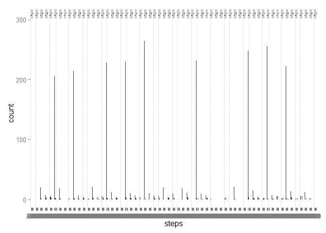
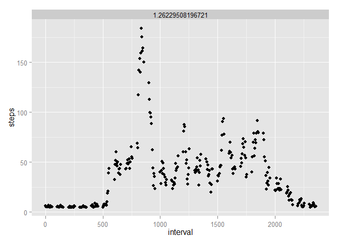

Peer Assessment 1 for RR
============================

First you need to load the data set to R:


```r
activity <- read.csv("C:/Grad Classes/DataScience/Reproducible Research/RepData_PeerAssessment1/activity/activity.csv")
```


Load ggplot2 package:


```r
library(ggplot2)
```

Below is a histogram, the mean, and the median for the total number of steps taken per day:


```r
qplot(steps,data=activity,facets=.~date,binwidth=30)
```

 

Mean number of steps per day:

```r
 mean(activity$steps,na.rm=TRUE)
```

```
## [1] 37.38
```

Median number of steps per day:


```r
median(activity$steps,na.rm=TRUE)
```

```
## [1] 0
```

A time series plot of the 5-minute intervale and the average number of steps taken, averaged across all days:

```r
x <- aggregate(.~interval,FUN=mean,na.rm=TRUE,data=activity)
qplot(interval,steps,data=x,geom="line")
```

 

Which 5-minute interval, on average across all the days in the dataset, contains the maximum number of steps?

```r
subset(x,steps==max(x$steps),select=interval)
```

```
##     interval
## 104      835
```

Calculate and report the total number of missing values in the dataset (i.e. the total number of rows with NAs)

```r
colSums(is.na(activity))
```

```
##    steps     date interval 
##     2304        0        0
```

Missing values will be imputed with the overall mean reported above

```r
activity.new <- activity
activity.new[is.na(activity.new)] <- mean(activity$steps,na.rm=TRUE)
```

Histogram,mean, and median of total number of steps taken per day within activity.new

```r
qplot(steps,data=activity.new,facets=.~date,binwidth=30)
```

 

Mean number of steps per day:

```r
 mean(activity.new$steps,na.rm=TRUE)
```

```
## [1] 37.38
```

Median number of steps per day:


```r
median(activity.new$steps,na.rm=TRUE)
```

```
## [1] 0
```

The values do not differ since I used the overall mean to replace the missing values. If I used something else, then the mean and median would chance accordingly.

Create a new factor variable in the dataset with two levels – “weekday” and “weekend” indicating whether a given date is a weekday or weekend day:

```r
activity.new$date <- as.Date(activity.new$date)
activity.new$day <- weekdays(activity.new$date)
activity.new$day[activity.new$day=="Monday"] <- "Weekday"
activity.new$day[activity.new$day=="Tuesday"] <- "Weekday"
activity.new$day[activity.new$day=="Wednesday"] <- "Weekday"
activity.new$day[activity.new$day=="Thursday"] <- "Weekday"
activity.new$day[activity.new$day=="Friday"] <- "Weekday"
activity.new$day[activity.new$day=="Saturday"] <- "Weekend"
activity.new$day[activity.new$day=="Sunday"] <- "Weekend"
activity.new$day <- as.factor(activity.new$day)
```

Make a panel plot containing a time series plot of the 5-minute interval (x-axis) and the average number of steps taken, averaged across all weekday days or weekend days (y-axis):


```r
z <- aggregate(.~interval,FUN=mean,na.rm=TRUE,data=activity.new)
qplot(interval,steps,data=z,facets=.~day)
```

 


