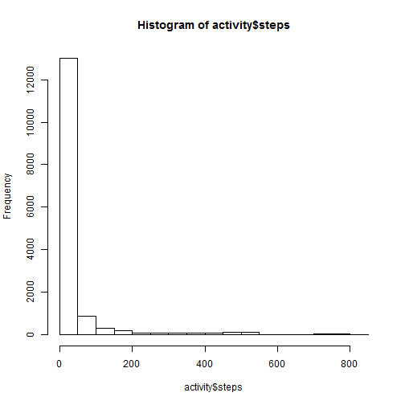

Peer Assessment 1--Reproducible Research
========================================================


The first step is to load the dataset to R:


```r
activity <- read.csv("C:/Grad Classes/DataScience/Reproducible Research/RepData_PeerAssessment1/activity/activity.csv")
```


What is mean total number of steps taken per day?

Below is a histogram, the mean, and the median values:


```r
        hist(activity$steps)
```

 

```r
        mean(activity$steps,na.rm=TRUE)
```

```
## [1] 37.38
```

```r
        median(activity$steps,na.rm=TRUE)
```

```
## [1] 0
```


